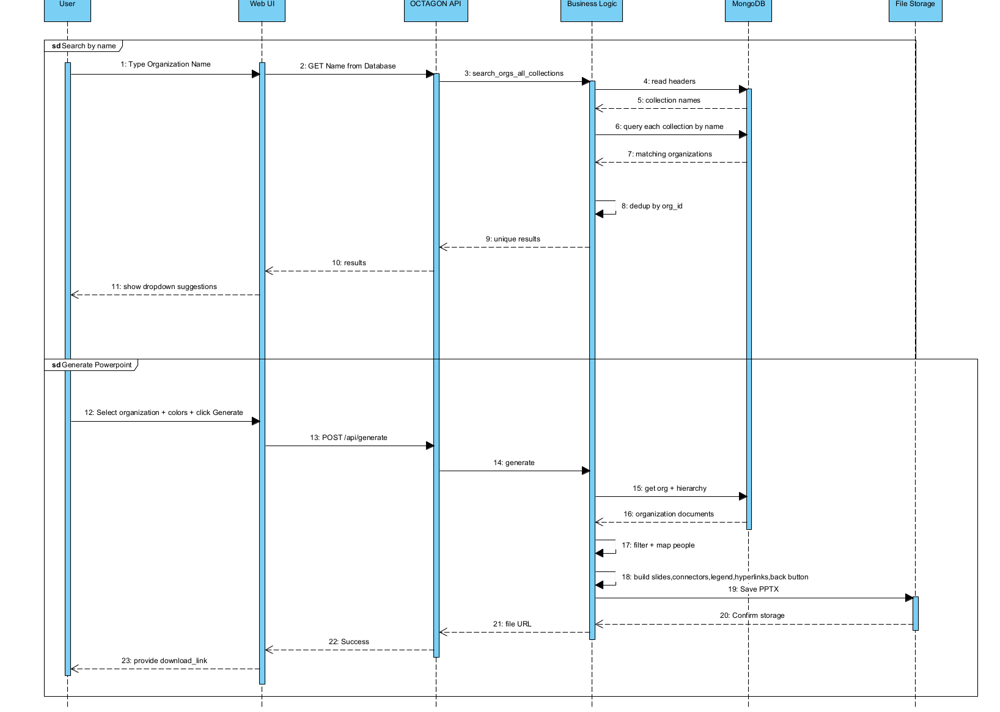

# Octagon – Organizational Chart PowerPoint Generator

A backend service that automatically generates Microsoft PowerPoint organizational charts from hierarchical data stored in MongoDB.

The application exposes a REST API that allows external applications to request a PowerPoint presentation for a specific organization. It retrieves the organization's hierarchy, applies business rules, maps the data into presentation models, and generates a `.pptx` file using a predefined template.

---

## Features

- REST API for PowerPoint generation
- Dynamic MongoDB collection selection
- Organization hierarchy traversal
- Employee filtering
  - Include / exclude external employees
  - Include / exclude trainees
- Automatic PowerPoint generation
- Multi-slide support for large organizations
- Automatic connector lines between manager and organizational units
- Configurable output filename
- Preset templates, colors can also be changed manually

---

## Tech Stack

- Python
- Flask
- MongoDB
- MongoEngine
- python-pptx

---

---

## Request Example (if we use ThunderClient , not our  web page)

```http
POST /api/generate
```

```json
{
  "org_id": "53182375",
  "collection_name": "1779348607187",
  "include_externals": true,
  "include_trainees": false,
  "template_name": "default",
  "output_name": "organization_chart"
}
```

---

## Response Example

```json
{
  "success": true,
  "message": "PPT generated successfully",
  "file_url": "generated/organization_chart.pptx"
}
```

---

## Workflow



---


## ScreenShots


