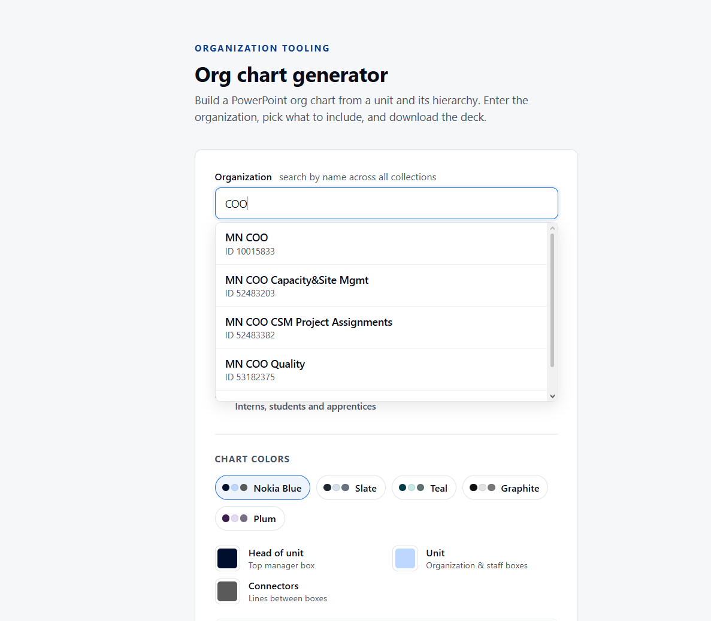
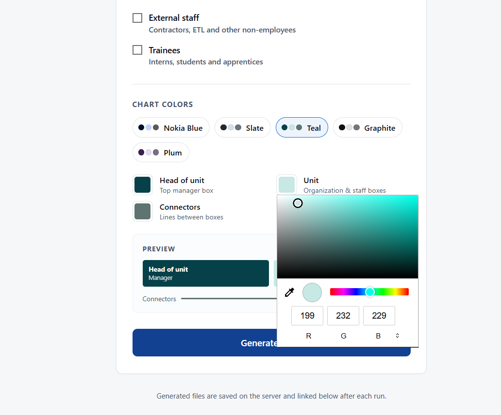
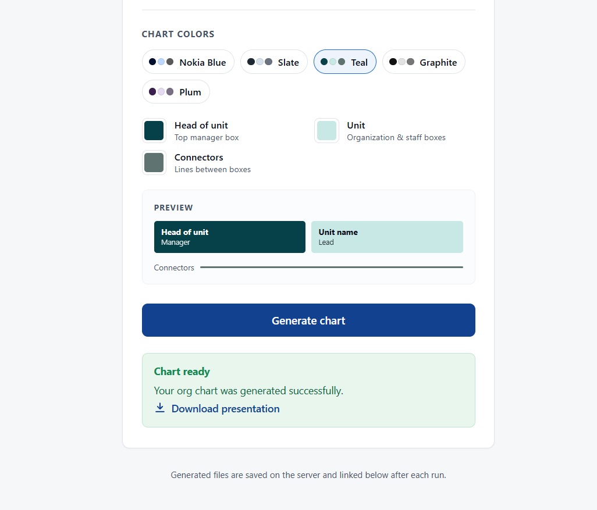
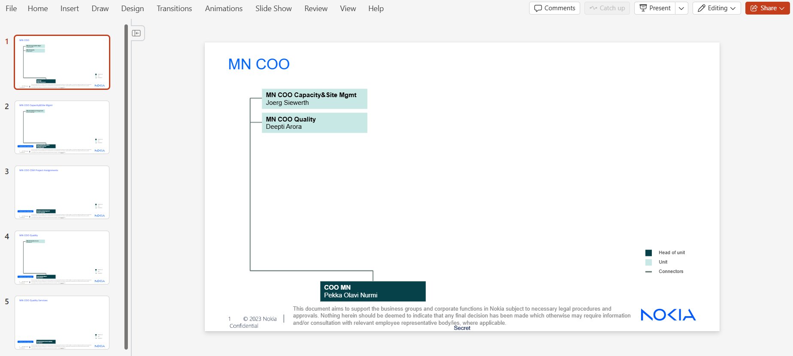

# Octagon – Organizational Chart PowerPoint Generator

Octagon is a backend REST API that generates Nokia organizational charts in PowerPoint format from hierarchical data stored in MongoDB. The service is designed to be consumed by the Sort Tool, which sends generation requests through the API.

The application exposes a REST API that allows external applications to request a PowerPoint presentation for a specific organization. It retrieves the organization's hierarchy, applies business rules, maps the data into presentation models, and generates a `.pptx` file using a predefined template.

---

## Features

- REST API for PowerPoint generation
- Dynamic MongoDB collection selection
- Organization hierarchy traversal
- Employee filtering
  - Include / exclude external employees
  - Include / exclude trainees
- Automatic PowerPoint generation
- Multi-slide support for large organizations
- Automatic connector lines between manager and organizational units
- Configurable output filename
- Preset templates, colors can also be changed manually

---

## Tech Stack

- Python
- Flask
- MongoDB
- MongoEngine
- python-pptx

---

---

## Request Example (if we use ThunderClient , not our  web page)

```http
POST /api/generate
```

```json
{
  "org_id": "53182375",
  "collection_name": "1779348607187",
  "include_externals": true,
  "include_trainees": false,
  "template_name": "default",
  "output_name": "organization_chart"
}
```

---

## Response Example

```json
{
  "success": true,
  "message": "PPT generated successfully",
  "file_url": "generated/organization_chart.pptx"
}
```

---

## Workflow


---


## ScreenShots

- Main screen — organization name search with live dropdown suggestions.




- Color customization — presets (Nokia Blue, Slate, Teal, Graphite, Plum) and custom per-role color
pickers with live preview.




- Generated result — success message with the download link for the .pptx.



- Generated PowerPoint — primary organization slide with hyperlinked sub-organization boxes and "back to  main parent" button




---

## My contribution

This project was made by a four member team, me included. I duplicated the project to have it safely stored on my personal github.

My responsabilities included:

- Designing and implementing the REST API endpoints.
- Coordinating the backend workflow between the different services.
- Implementing the request and response models
- Developing the landing page (`index.html`) used to interact efficiently with the service.
- Testing, debugging, and validating the complete generation workflow, done not only by me, but by the rest of the team aswell.
